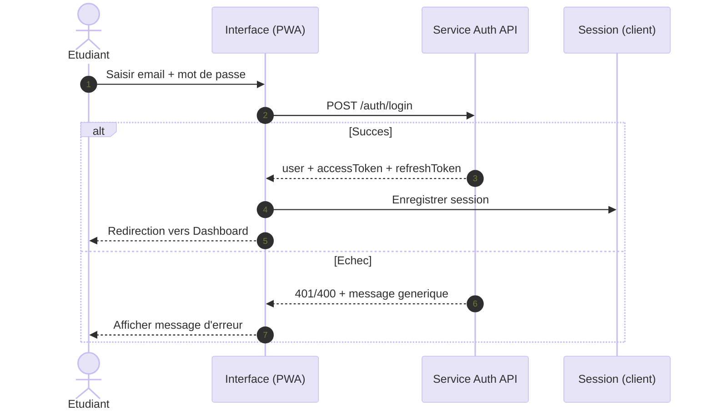
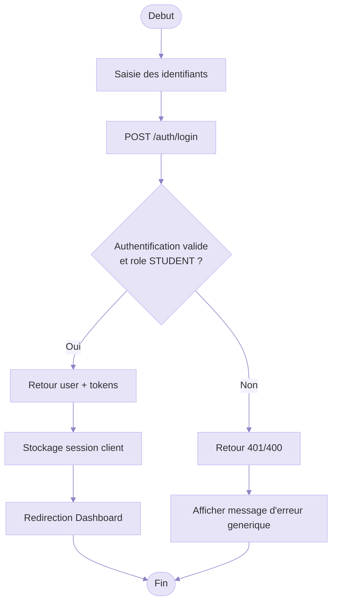

# Authentification - Texte Ajuste Et Diagrammes

Le flux est le suivant : l’etudiant saisit son email et son mot de passe dans l’interface, puis l’application envoie la requete de connexion au service d’authentification. Si la connexion reussit, le service renvoie l’utilisateur et les jetons, la session est enregistree cote client, puis l’utilisateur est redirige vers le Dashboard. Si la connexion echoue, le service renvoie une erreur (401/400) et l’interface affiche un message d’erreur.

## Figure 4 - Diagramme De Sequence (Mermaid)

## Diagramme D’activites (Mermaid)

